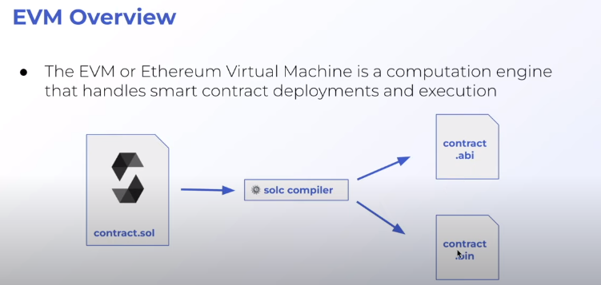
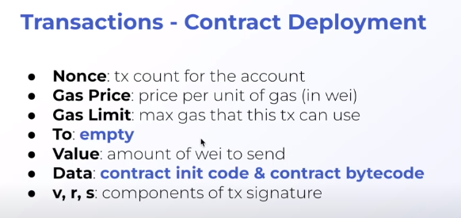
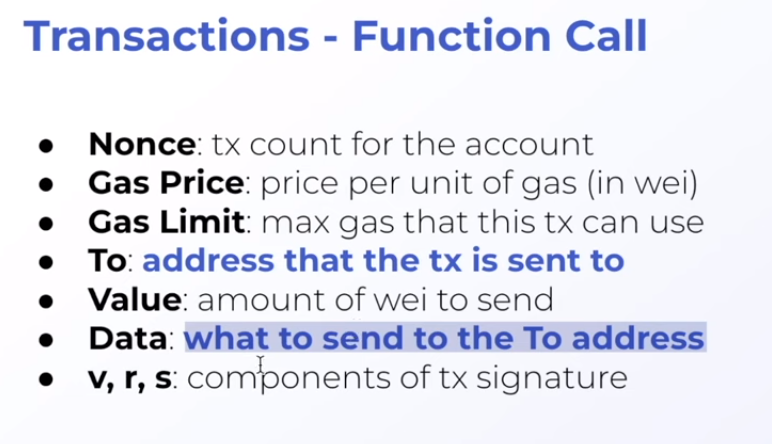

## Notes

### base64

To encode with base64 a file, we run:
`base64 -i example.svg`

And then we paste it after this:
`data:image/svg+xml;base64,OUTPUT_HERE`

data:image/svg+xml;base64,PHN2ZyB4bWxucz0iaHR0cDovL3d3dy53My5vcmcvMjAwMC9zdmciIHhtbG5zOnhsaW5rPSJodHRw
Oi8vd3d3LnczLm9yZy8xOTk5L3hsaW5rIiB3aWR0aD0iNTAwIiBoZWlnaHQ9IjUwMCI+Cjx0ZXh0
IHg9IjAiIHk9IjE1IiBmaWxsPSJibGFjayI+SGkhIFlvdXIgYnJvd3NlciBkZWNvZGVkIHRoaXM8
L3RleHQ+Cjwvc3ZnPg==

### foundry.toml

ffi = true
means do whatever you want in the shell
you don't want to have this in your foundry.toml if you don't have to
fs_permissions = [{access = "read", path = "./images/"}]
only gives permission to read within a specific path

### abi.encodePacked

abi.encodePacked concatenates together a string

// 0.8.12 and above
can use
string.concat(stringA, stringB);

### EVM Overview

When compiling a contract with solc compiler, two files get generated: contract.abi and contract.bin

### base64.encode

This encodes a bytes object into a base64 readable format

### Patrick tasks for learning more

Write a:

- script for minting the moodNft
- script for flipping the moodNft

## Actual SVGs

These can be used as Image URI within an NFT to store it fully onchain.

Happy SVG:

data:image/svg+xml;base64,PHN2ZyB2aWV3Qm94PSIwIDAgMjAwIDIwMCIgd2lkdGg9IjQwMCIgIGhlaWdodD0iNDAwIiB4bWxucz0iaHR0cDovL3d3dy53My5vcmcvMjAwMC9zdmciPgogIDxjaXJjbGUgY3g9IjEwMCIgY3k9IjEwMCIgZmlsbD0ieWVsbG93IiByPSI3OCIgc3Ryb2tlPSJibGFjayIgc3Ryb2tlLXdpZHRoPSIzIi8+CiAgPGcgY2xhc3M9ImV5ZXMiPgogICAgPGNpcmNsZSBjeD0iNjEiIGN5PSI4MiIgcj0iMTIiLz4KICAgIDxjaXJjbGUgY3g9IjEyNyIgY3k9IjgyIiByPSIxMiIvPgogIDwvZz4KICA8cGF0aCBkPSJtMTM2LjgxIDExNi41M2MuNjkgMjYuMTctNjQuMTEgNDItODEuNTItLjczIiBzdHlsZT0iZmlsbDpub25lOyBzdHJva2U6IGJsYWNrOyBzdHJva2Utd2lkdGg6IDM7Ii8+Cjwvc3ZnPg==

Sad SVG:

data:image/svg+xml;base64,PHN2ZyB3aWR0aD0iMTAyNHB4IiBoZWlnaHQ9IjEwMjRweCIgdmlld0JveD0iMCAwIDEwMjQgMTAyNCIgeG1sbnM9Imh0dHA6Ly93d3cudzMub3JnLzIwMDAvc3ZnIj4KICA8cGF0aCBmaWxsPSIjMzMzIiBkPSJNNTEyIDY0QzI2NC42IDY0IDY0IDI2NC42IDY0IDUxMnMyMDAuNiA0NDggNDQ4IDQ0OCA0NDgtMjAwLjYgNDQ4LTQ0OFM3NTkuNCA2NCA1MTIgNjR6bTAgODIwYy0yMDUuNCAwLTM3Mi0xNjYuNi0zNzItMzcyczE2Ni42LTM3MiAzNzItMzcyIDM3MiAxNjYuNiAzNzIgMzcyLTE2Ni42IDM3Mi0zNzIgMzcyeiIvPgogIDxwYXRoIGZpbGw9IiNFNkU2RTYiIGQ9Ik01MTIgMTQwYy0yMDUuNCAwLTM3MiAxNjYuNi0zNzIgMzcyczE2Ni42IDM3MiAzNzIgMzcyIDM3Mi0xNjYuNiAzNzItMzcyLTE2Ni42LTM3Mi0zNzItMzcyek0yODggNDIxYTQ4LjAxIDQ4LjAxIDAgMCAxIDk2IDAgNDguMDEgNDguMDEgMCAwIDEtOTYgMHptMzc2IDI3MmgtNDguMWMtNC4yIDAtNy44LTMuMi04LjEtNy40QzYwNCA2MzYuMSA1NjIuNSA1OTcgNTEyIDU5N3MtOTIuMSAzOS4xLTk1LjggODguNmMtLjMgNC4yLTMuOSA3LjQtOC4xIDcuNEgzNjBhOCA4IDAgMCAxLTgtOC40YzQuNC04NC4zIDc0LjUtMTUxLjYgMTYwLTE1MS42czE1NS42IDY3LjMgMTYwIDE1MS42YTggOCAwIDAgMS04IDguNHptMjQtMjI0YTQ4LjAxIDQ4LjAxIDAgMCAxIDAtOTYgNDguMDEgNDguMDEgMCAwIDEgMCA5NnoiLz4KICA8cGF0aCBmaWxsPSIjMzMzIiBkPSJNMjg4IDQyMWE0OCA0OCAwIDEgMCA5NiAwIDQ4IDQ4IDAgMSAwLTk2IDB6bTIyNCAxMTJjLTg1LjUgMC0xNTUuNiA2Ny4zLTE2MCAxNTEuNmE4IDggMCAwIDAgOCA4LjRoNDguMWM0LjIgMCA3LjgtMy4yIDguMS03LjQgMy43LTQ5LjUgNDUuMy04OC42IDk1LjgtODguNnM5MiAzOS4xIDk1LjggODguNmMuMyA0LjIgMy45IDcuNCA4LjEgNy40SDY2NGE4IDggMCAwIDAgOC04LjRDNjY3LjYgNjAwLjMgNTk3LjUgNTMzIDUxMiA1MzN6bTEyOC0xMTJhNDggNDggMCAxIDAgOTYgMCA0OCA0OCAwIDEgMC05NiAweiIvPgo8L3N2Zz4=

Example SVG:

PHN2ZyB4bWxucz0iaHR0cDovL3d3dy53My5vcmcvMjAwMC9zdmciIHhtbG5zOnhsaW5rPSJodHRw
Oi8vd3d3LnczLm9yZy8xOTk5L3hsaW5rIiB3aWR0aD0iNTAwIiBoZWlnaHQ9IjUwMCI+PHRleHQg
eD0iMCIgeT0iMTUiIGZpbGw9ImJsYWNrIj5IaSEgWW91ciBicm93c2VyIGRlY29kZWQgdGhpczwv
dGV4dD48L3N2Zz4=
